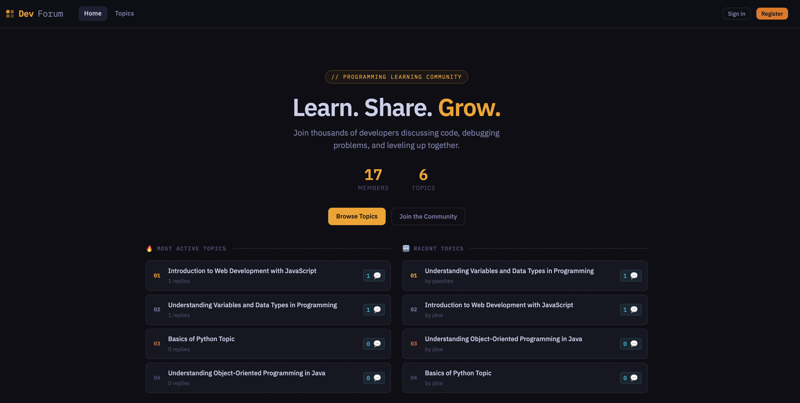
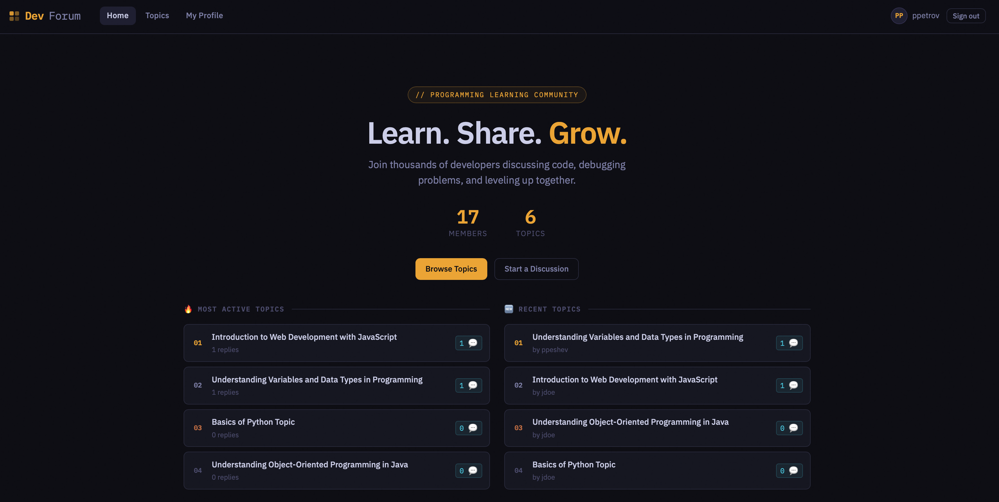
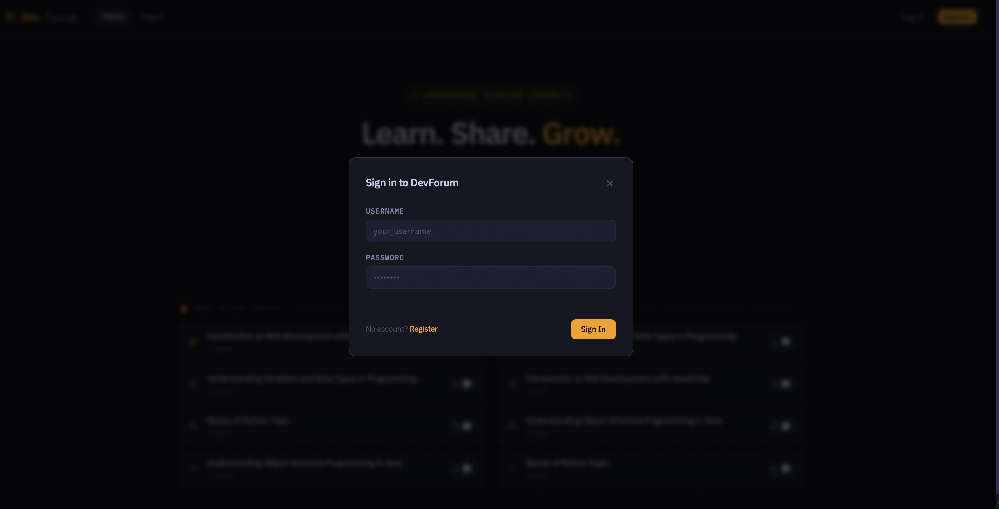
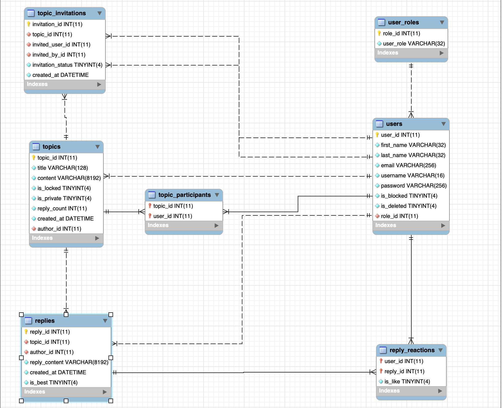

# Forum System - FastAPI REST API
A full-featured discussion forum platform built with FastAPI and MariaDB. Users can create topics, post replies, react to content, and manage private discussions with invitation-based access control. Admins have full moderation capabilities across the entire platform.

## Table of Contents

- [Project Description](#project-description)
- [Features](#features)
- [API Overview](#api-overview)
- [Authentication & Security](#authentication--security)
- [Tech Stack](#tech-stack)
- [Setup & Installation](#setup--installation)
- [Known Limitations](#known-limitations)
- [Git History Note](#git-history-note)
- [Home Page](#home-page---before-and-after-login)
- [Database Diagram](#database-diagram)
- [Contributors](#contributors)

## Project Description

This Forum System is a RESTful web service that allows users to engage in structured discussions around shared topics. The platform supports public browsing without an account, authenticated participation for posting and reacting, private topics with invitation-based access, and full admin moderation.

## Features

- Users
    - Register and log in with JWT-based authentication
    - Update profile information (name, email, password) with password confirmation
    - Soft-delete account — content is preserved, account access is revoked
    - View own topics and replies with pagination

- Topics
    - Create public or private topics
    - Edit and delete own topics
    - Sort and search topics by keyword, reply count, or creation date
    - Private topics are accessible only to the author and invited/accepted participants

- Replies
    - Reply to any unlocked topic the user has access to
    - Edit and delete own replies
    - Topic authors can mark one reply per topic as the best answer

- Reactions
    - Like or dislike any reply (not your own)
    - One reaction per user per reply — switching between like and dislike is supported
    - Reaction counts are public; authenticated users also see their own reaction

- Invitations & Participants
    - Topic authors can invite specific users to private topics (single or bulk)
    - Invited users can accept or decline; accepting grants participant access
    - Participants can leave at any time; authors and admins can remove participants

- Admin Panel
    - Search users by username, email, or name
    - Block or unblock users (blocked users cannot create topics or replies)
    - Lock or unlock topics (locked topics are read-only)
    - Promote or demote users to and from admin role
    - Delete any topic or reply across the platform
    - Last admin on the platform cannot be demoted (safety guard)

- Public Stats
    - Total user and topic counts
    - Top 10 topics by reply count
    - Top 10 most recently created topics

## API Overview

All endpoints return a consistent JSON envelope:
```json
{
    "message": "Human-readable status message",
    "data": { ... }
}
```
- Endpoints marked [Auth] require a Bearer token in the Authorization header.
- Endpoints marked [Admin] additionally require the user to have the admin role.
- Endpoints marked [Public] work without any token.

### Auth

|Method |Endpoint         |Access   |Description                                                    |
|------ |---------        |-------- |-----------                                                    |
|POST   |/auth/register   |Public   |Create a new user account                                      |
|POST   |/auth/login      |Public   |Authenticate and receive a JWT                                 |

    Login uses form data, not JSON. Send username and password as application/x-www-form-urlencoded.
    The Swagger UI "Authorize" button handles this automatically.

### Users

|Method |Endpoint                   |Access |Description                                                    |
|------ |---------                  |------ |-----------                                                    |
|GET    |/users/                    |Admin  |List all users with optional search and pagination             |
|GET    |/users/{user_id}           |Auth   |Get a user's public profile                                    |
|PATCH  |/users/{user_id}           |Auth   |Update own profile (admin can update any user)                 |
|DELETE |/users/{user_id}           |Auth   |Soft-delete own account (password required)                    |
|GET    |/users/me/topics           |Auth   |Get my topics                                                  |
|GET    |/users/me/replies          |Auth   |Get my replies                                                 |
|PATCH  |/users/{user_id}/block     |Admin  |Block a user                                                   |
|PATCH  |/users/{user_id}/unblock   |Admin  |Unblock a user                                                 |
|PATCH  |/users/{user_id}/promote   |Admin  |Promote user to admin                                          |
|PATCH  |/users/{user_id}/demote    |Admin  |Demote admin to user (last admin is protected)                 |

    User deletion is soft. The account is flagged as deleted
    (is_deleted = 1), revoking login access, but all authored
    topics and replies remain intact in the database.

    Public user responses never expose email or password.
    The UserPublic model intentionally omits both fields.
    Admins can search by email, but the email itself is
    not returned in any response body.

### Topics

|Method |Endpoint                                 |Access     |Description                                              |
|------ |---------                                |------     |-----------                                              |
|POST   |/topics/                                 |Auth       |Create a new topic (public or private)                   |
|GET    |/topics/                                 |Public/Auth|List topics with search, filter, sort, and pagination    |
|GET    |/topics/{topic_id}                       |Public/Auth|Get a single topic                                       |
|PATCH  |/topics/{topic_id}                       |Auth       |Update own topic title, content, or visibility           |
|DELETE |/topics/{topic_id}                       |Auth       |Delete own topic (admin can delete any)                  |
|PATCH  |/topics/{topic_id}/lock                  |Admin      |Lock a topic (no new replies allowed)                    |
|PATCH  |/topics/{topic_id}/unlock                |Admin      |Unlock a topic                                           |
|GET    |/topics/{topic_id}/replies               |Public/Auth|List replies (best reply shown first, then by date)      |
|POST   |/topics/{topic_id}/replies               |Auth       |Post a new reply to a topic                              |
|GET    |/topics/{topic_id}/participants          |Auth       |List participants of a private topic                     |
|DELETE |/topics/{topic_id}/participants/{user_id}|Auth       |Remove a participant (author or admin only)              |
|POST   |/topics/{topic_id}/leave                 |Auth       |Leave a private topic (participants only, not the author)|

#### Topic List Query Params

|Parameter  |Type     |Default    |Description                          |
|---------  |-------  |-------    |-----------                          |
|search     |string   |-          |Searches title and content           |
|author_id  |integer  |-          |Filter by author                     |
|is_private |boolean  |-          |Filter public or private only        |
|is_locked  |boolean  |-          |Filter locked or unlocked only       |
|sort_by    |string   |created_at |created_at, reply_count, or title    |
|sort_order |string   |asc        |asc or desc                          |
|page       |integer  |1          |Page number                          |
|per_page   |integer  |20         |Items per page (max 100)             |

    Private topic visibility: Anonymous users never see private topics.
    Authenticated users only see private topics they authored or were accepted into.
    Admins see all topics.

    When a private topic is created, the author is automatically added as a participant.
    The author appears in the participant list alongside other accepted members.

    Locked topics block new replies but not edits. The topic author can still
    update the title or content of a locked topic. Only admins can lock or unlock.

### Replies

|Method |Endpoint                        |Access |Description                                |
|------ |---------                       |------ |-----------                                |
|PUT    |/replies/{reply_id}             |Auth   |Update reply content (author only)         |
|DELETE |/replies/{reply_id}             |Auth   |Delete a reply (author or admin)           |
|PATCH  |/replies/{reply_id}/mark-best   |Auth   |Mark as best answer (topic author only)    |
|PATCH  |/replies/{reply_id}/unmark-best |Auth   |Remove best answer mark (topic author only)|

    Only one best reply per topic. Marking a new reply as best
    automatically clears the previous best reply for that topic.

    Topic authors cannot mark their own reply as best.
    This is an intentional restriction to encourage genuine
    community recognition.

### Reactions

|Method |Endpoint                      |Access      |Description                                                    |
|------ |---------                     |------      |-----------                                                    |
|POST   |/replies/{reply_id}/like      |Auth        |Like a reply (or change existing dislike to like)              |
|POST   |/replies/{reply_id}/dislike   |Auth        |Dislike a reply (or change existing like to dislike)           |
|DELETE |/replies/{reply_id}/reactions |Auth        |Remove your reaction from a reply                              |
|GET    |/replies/{reply_id}/reactions |Public/Auth |Get like/dislike counts; authenticated users also see their own reaction|

    Users cannot react to their own replies.

    One reaction per user per reply. Posting a like when a
    dislike already exists silently overwrites it, and vice versa.

### Invitations

|Method|Endpoint                    |Access |Description                                               |
|------|---------                   |------ |-----------                                               |
|POST  |/invitations/               |Auth   |Invite a user to a private topic (topic author only)      |
|POST  |/invitations/bulk           |Auth   |Invite up to 50 users at once (topic author only)         |
|GET   |/invitations/               |Auth   |List your own received invitations (filterable by status) |
|GET   |/invitations/{invitation_id}|Auth   |Get a single invitation (sender, recipient, or admin)     |
|PATCH |/invitations/{invitation_id}|Auth   |Accept or decline an invitation (recipient only)          |
|DELETE|/invitations/{invitation_id}|Auth   |Delete an invitation (topic author or admin)              |

    Invitation statuses: 0 = PENDING, 1 = ACCEPTED, 2 = DECLINED.
    Only PENDING invitations can be accepted or declined. Accepting
    automatically adds the user to the topic's participant list.


    Bulk invite is partial-failure tolerant. If some users fail (already
    invited, blocked, not found), those failures are collected in
    the response without aborting the rest of the batch.

### Stats

|Method|Endpoint  |Access |Description                                                      |
|------|--------- |------ |-----------                                                      |
|GET   |/stats/   |Public |Total users, total topics, top 10 by replies, top 10 most recent |

    Stats only surface public topics. Private topics are
    excluded from all counts and rankings.

## Authentication & Security

### How authentication works

Login returns a JWT Bearer token. Include it in every protected request:

    Authorization: Bearer <your_token>

### Token lifetime

Tokens are valid for 30 minutes from the time of issue. There is currently no refresh token mechanism. Once a token expires, the user must call POST /auth/login again to obtain a new one.

    Implication for clients: Applications must handle 401 Unauthorized responses and trigger a re-login flow. If you need persistent sessions, consider storing credentials securely and re-authenticating automatically on token expiry.

### Password hashing

Passwords use a two-step hashing process:

    1. The plain-text password is first digested with SHA-256.
    2. The SHA-256 hex string is then hashed with bcrypt.

This protects against bcrypt's 72-character input limit, ensuring long passwords are always fully hashed.

## Tech Stack

|Layer      |     Technology                                               |
|-------    |     ----------                                               |
|Runtime    |     Python 3.12                                              |
|Framework  |     FastAPI 0.128                                            |
|Database   |     MariaDB via mariadb driver                               |
|Auth       |     JWT (python-jose) + bcrypt                               |
|Validation |     Pydantic v2                                              |
|Password   |     bcrypt + SHA-256 pre-hash                                |
|Config     |     python-dotenv                                            |
|Testing    |     unit tests                                               |
|ASGI server|     Uvicorn                                                  |
|Frontend   | HTML + CSS + JS (AI-assisted, not the focus of this project) |

## Setup & Installation

Follow these steps to set up and run the Forum API locally:

### Prerequisites:

Make sure you have installed:

- Python 3.12 or newer
- MariaDb
- GIT
- pip

All required Python dependencies are listed in:

requirements.txt

1. **Clone the repository**

    git clone git clone https://github.com/Akosherov/programming-forum.git
    cd <forum_project>


2. **Create and activate virtual environment**

    Mac/Linux:

        python3 -m venv .venv
        source .venv/bin/activate

    Windows:

        python -m venv .venv
        .venv\Scripts\activate

3. **Install Dependencies**

        pip install -r requirements.txt

4. **Configure Environment Variables**

    Create a .env file in the project root (the same directory as main.py). The application loads this file automatically on startup via python-dotenv — no extra configuration is needed.

        SECRET_KEY=your_secret_key_here
        ALGORITHM=HS256
        DB_HOST=localhost
        DB_USER=your_db_user
        DB_PASSWORD=your_db_password
        DB_NAME=forum_schema2.0

        The .env file is read once when the application starts. If you change any value, restart the server for it to take effect.

        Never commit the .env file to source control. Add it to .gitignore.

5. **Start the database server**

    Make sure MariaDB is running.

    Example(Mac Homebrew):

        brew services start mariadb

6. **Run the FastAPI server**

        uvicorn main:app --reload

    Server will start at:

        http://127.0.0.1:8000

7. **Access API documentation (Swagger UI)**

    Open the browser:

        http://127.0.0.1:8000/docs

To test protected endpoints in the Swagger UI, click Authorize at the top of the page and enter your token as Bearer <token>.

This allows you to:

- Register users
- Login and authenticate
- Create topics
- Post replies
- Manage topics                                                         |

## Known Limitations

- No token refresh. JWTs expire after 30 minutes with no refresh endpoint. Users must log in again to obtain a new token.
- No connection pooling. Every request opens and closes its own MariaDB connection. Sufficient for development; needs pooling before production.
- Hard-delete for topics and replies. Only users are soft-deleted. Deleting a topic cascades to its replies, reactions, invitations, and participants at the database level and cannot be undone.
- No email notifications. Invitation events, best-reply selections, and admin actions produce no out-of-band communication.
- No rate limiting. Login attempts and API calls are not throttled.

## Git History Note
This repository was migrated from a private organization repository to this
public repo. As a result, the full commit history was not carried over.
The original development history existed in the private repository
throughout the project lifecycle.

#### Home Page - before and after login





#### Login Page



## Database Diagram


